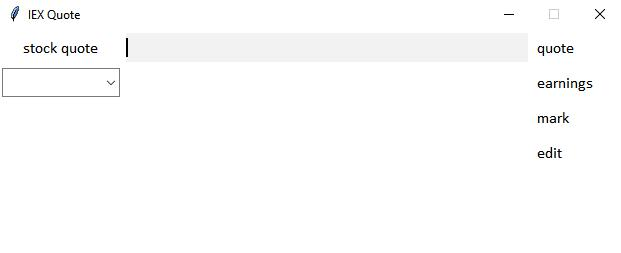
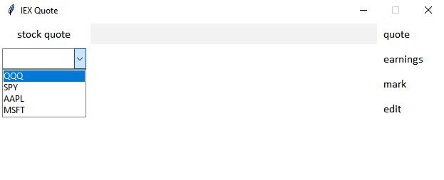
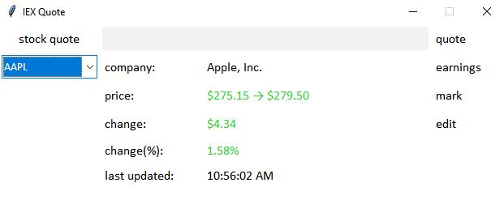
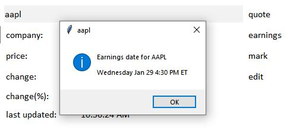
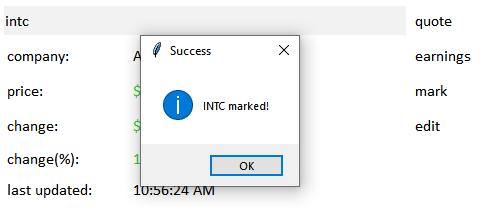

# stocky
Windows application using python Tkinter to get stock quotes from IEX API (and earnings dates from earningswhispers)
Created this because it a lot faster than using websites if I just want to know the stock price of some company. (And earnings date)

If you want to try out the application I think you'll need to install BeautifulSoup. Other libraries should be available along with Python I think.
:^)

A token key can be obtained from IEX's website: https://iexcloud.io/docs/api/

Or if you just want to see how it kinda looks like, here you go. :^)

